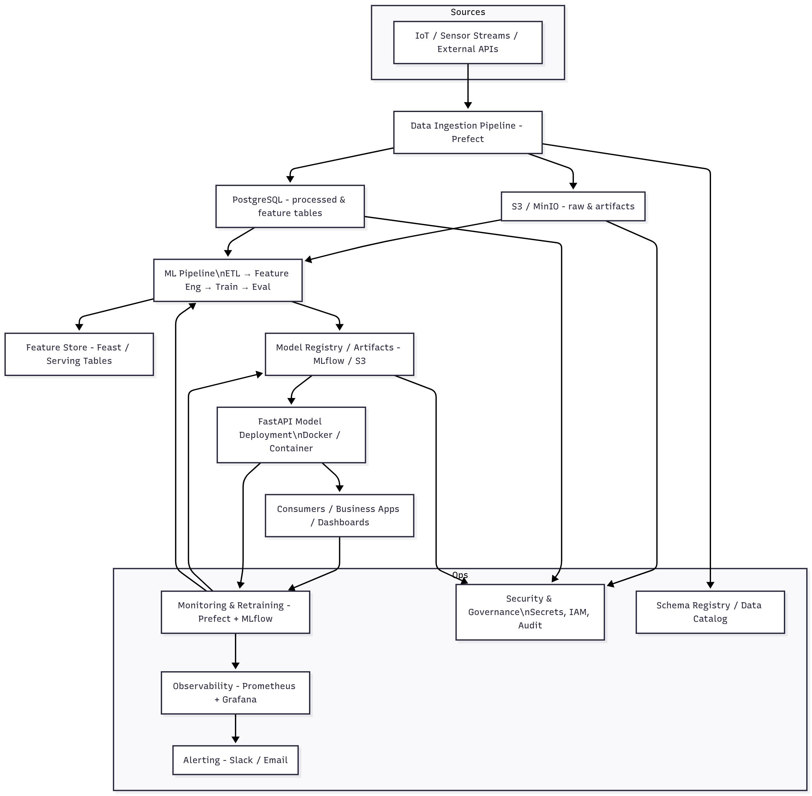

# 🧠 AURA: Autonomous Understanding & Reliability Analytics System

> **An end-to-end AI/ML engineering project for predictive maintenance**  
> Designed to simulate real-world industrial ML system architecture, following modern MLOps and data engineering best practices.

---

## 📘 Project Overview

**AURA (Autonomous Understanding & Reliability Analytics System)** is a simulated industrial **Predictive Maintenance Platform** that forecasts potential equipment failures using machine learning.

The system mimics the workflow of an AI & Robotics engineering company (inspired by ARV) — where IoT sensor data is collected, processed, modeled, deployed, and monitored in a production-like environment.

This project demonstrates **full-cycle ML engineering** — from raw data ingestion to deployment and monitoring — showcasing technical leadership, scalable architecture design, and strategic ML initiative planning.

---

## 🎯 Key Objectives

| Objective | Description |
|------------|--------------|
| **End-to-End ML Pipeline** | Design and implement a reproducible ML pipeline covering ingestion, storage, modeling, deployment, and monitoring. |
| **Production-Ready Architecture** | Build modular components using containerized services (PostgreSQL, MinIO, Prefect, MLflow, FastAPI). |
| **Scalable Data Infrastructure** | Utilize both structured (PostgreSQL) and unstructured (S3-compatible MinIO) storage solutions. |
| **Model Lifecycle Management** | Automate model training, versioning, and retraining through Prefect + MLflow integration. |
| **Operational Excellence** | Integrate observability, data governance, and security compliance best practices (SSHE alignment). |
| **Leadership Simulation** | Demonstrate technical decision-making through documented ADRs, architecture design, and roadmap planning. |

---

## 🏗️ System Architecture

The project follows a modular and extensible ML system design.



> See the full explanation in [`docs/system_architecture.md`](./docs/system_architecture.md)

### Architecture Highlights
- **Data ingestion** via Prefect, simulating IoT / sensor streams.
- **Storage layer** split between PostgreSQL (structured) and MinIO (raw & artifacts).
- **ML pipeline** for ETL, feature engineering, model training, and evaluation.
- **Model deployment** via FastAPI (Dockerized).
- **Monitoring and retraining** orchestrated with Prefect + MLflow.
- **Phase 2+ extensions:** Kafka/MQTT streaming, Feast feature store, Prometheus monitoring, and compliance layers.

---

## 🧰 Tech Stack

| Layer | Tools / Frameworks |
|-------|--------------------|
| **Languages** | Python 3.10 |
| **Workflow Orchestration** | Prefect |
| **Data Storage** | PostgreSQL (structured), MinIO (S3-compatible, unstructured) |
| **Machine Learning** | Scikit-learn, XGBoost, MLflow |
| **APIs / Serving** | FastAPI, Uvicorn |
| **Containerization** | Docker, Docker Compose |
| **Monitoring / Tracking** | MLflow, Prefect UI (future: Prometheus + Grafana) |
| **Version Control & Documentation** | Git, Markdown, ADRs |

---

## ⚙️ Setup Instructions

### 1. Clone the Repository
```bash
git clone https://github.com/<your-username>/aura-ml-platform.git
cd aura-ml-platform
````

### 2. Create a Python Environment

```bash
conda create -n aura python=3.10
conda activate aura
pip install -r requirements.txt
```

### 3. Start Core Services

Run the PostgreSQL and MinIO services via Docker Compose:

```bash
docker compose up -d
```

Once running:

* PostgreSQL accessible at `localhost:5432`
* MinIO accessible at `http://localhost:9000` (default creds in `.env.example`)

### 4. Initialize Prefect (Optional)

```bash
prefect server start
prefect deployment apply ./prefect_flows/*.py
```

### 5. Run Sample Pipeline

```bash
python src/data_pipeline/ingest_sample.py
python src/modeling/train_model.py
```

### 6. Access Interfaces

* **Prefect UI:** [http://localhost:4200](http://localhost:4200)
* **MinIO Console:** [http://localhost:9001](http://localhost:9001)
* **MLflow UI (optional):** [http://localhost:5000](http://localhost:5000)

---

## 🗺️ Planned Milestones

| Phase                                        | Focus                                              | Deliverables                        |
| -------------------------------------------- | -------------------------------------------------- | ----------------------------------- |
| **Phase 1:** Strategy & Setup                | Architecture, environment, and repo structure      | Project docs + environment setup    |
| **Phase 2:** Data Engineering                | Ingestion, ETL, data validation                    | Prefect ingestion flow + DB schema  |
| **Phase 3:** Modeling                        | Feature engineering, training, and MLflow tracking | Trained model + experiment report   |
| **Phase 4:** Deployment                      | FastAPI serving, Dockerization                     | API endpoint + containerized model  |
| **Phase 5:** Monitoring & Optimization       | Drift detection, retraining, observability         | Prefect retraining flow + dashboard |
| **Phase 6 (Optional):** Scaling & Innovation | Feature store, streaming, compliance               | Kafka + Feast + governance layer    |

---

## 👏 Credits & Simulation Disclaimer

This project is a **self-initiated learning and simulation project** created by **Komsan Kongwongsupak**,
a Data Scientist transitioning into **AI/ML Engineering**.

* The dataset and business context are **simulated** for educational and portfolio purposes.
* The design, documentation, and code are inspired by **real-world ML Ops best practices**.

---

**© 2025 Komsan Kongwongsupak — ML Engineering Simulation Project**
For inquiries or collaborations, contact: *[[komsan.kongwongsupak@gmail.com](mailto:your.email@example.com)]*
