# System Architecture — AURA (Autonomous Understanding and Reliability Analytics)

> **Purpose:** This document describes the end-to-end architecture for the AURA predictive-maintenance ML platform. It is the single source of truth for Phase 1 design decisions, component responsibilities, data formats, and an implementation roadmap.

---

## Table of Contents

1. Overview
2. High-level Architecture Diagram (Mermaid)
3. Component Descriptions
4. Data Storage & Formats
5. Data Flow (End-to-end)
6. Security, Governance & SSHE considerations
7. Observability, Monitoring & Retraining
8. Implementation Phases & Roadmap
9. Deliverables for Phase 1
10. Project File Structure & Example Configs
11. Decisions & Tradeoffs
12. Next Steps

---

## 1. Overview

AURA is an ML platform to predict equipment failures and enable proactive maintenance for ARV-like industrial applications (air, land, sea). It demonstrates the design and implementation of a production-oriented ML system that handles structured and unstructured data, automated pipelines, model lifecycle management, deployment, monitoring, and governance.

**Primary goals**

* Ingest and store sensor and operational data (structured & unstructured)
* Build repeatable ML pipelines (ETL → Feature Engineering → Train → Evaluate)
* Deploy model(s) as containerized services
* Monitor model performance and automate retraining
* Document governance, safety, and compliance considerations

**Success metrics (example)**

* Model: recall, precision, F1 for failure detection; target thresholds defined per dataset
* System: reproducible end-to-end run, containerized deployment
* Process: retraining and redeployment triggered automatically when drift detected

---

## 2. High-level Architecture Diagram (Mermaid)

```mermaid
flowchart TD
  subgraph Sources
    A[IoT / Sensor Streams / External APIs]
  end

  A --> B[Data Ingestion Pipeline - Prefect]
  B --> C1[S3 / MinIO - raw & artifacts]
  B --> C2[PostgreSQL - processed & feature tables]

  C1 --> D[ML Pipeline\nETL → Feature Eng → Train → Eval]
  C2 --> D
  D --> E[Feature Store - Feast / Serving Tables]
  D --> F[Model Registry / Artifacts - MLflow / S3]
  F --> G[FastAPI Model Deployment\nDocker / Container]
  G --> H[Consumers / Business Apps / Dashboards]

  subgraph Ops
    I[Monitoring & Retraining - Prefect + MLflow]
    J[Observability - Prometheus + Grafana]
    K[Alerting - Slack / Email]
    L[Security & Governance\nSecrets, IAM, Audit]
    M[Schema Registry / Data Catalog]
  end

  H --> I
  G --> I
  I --> F
  I --> D
  B --> M
  C1 --> L
  C2 --> L
  F --> L
  I --> J --> K
```



> **Notes:** The diagram is intentionally modular—components marked as optional (Kafka, Feast, Prometheus) are listed in the Ops and Phase sections and can be added in later phases.

---

## 3. Component Descriptions

### Data Sources

* **What:** Simulated or real IoT sensors, telemetry logs, maintenance records, external APIs.
* **Role:** Provide structured sensor time series and unstructured logs/reports.

### Data Ingestion (Prefect)

* **What:** Orchestrated ETL flows.
* **Responsibilities:** Pull/batch data, validate, transform, write to raw storage (S3/MinIO), and write processed rows to PostgreSQL.

### Storage

* **S3 / MinIO (Object Storage)** — stores raw files, processed Parquet, model artifacts, logs. Use `.csv` for raw snapshots, `.parquet` for processed features, `.json` for logs and metadata, and `.pkl`/`.onnx` for models.
* **PostgreSQL (Relational)** — stores normalized business tables, processed feature tables (for offline training), labels, and metadata used for analytics and quick queries.

### ML Pipeline

* **What:** Scripts and flows for feature engineering, model training, evaluation, and model selection.
* **Tools:** scikit-learn / PyTorch, MLflow for experiment tracking.

### Feature Store (optional)

* **What:** Feast or simple serving tables in PostgreSQL for online features.
* **Why:** Low-latency feature serving for real-time inference in production.

### Model Registry & Deployment

* **Model Registry:** MLflow or S3 path conventions to version models and artifacts.
* **Deployment:** FastAPI exposing REST endpoints, containerized with Docker. Could be deployed locally or to cloud (ECS / GKE / Cloud Run) later.

### Monitoring & Retraining

* **Monitoring:** MLflow metrics, Prefect flow health, Prometheus + Grafana for system & infra metrics.
* **Retraining pipeline:** Prefect flows that detect drift or performance degradation and trigger retraining, evaluation, and redeployment.

### Observability & Alerts

* **What:** Prometheus (metrics), Grafana (dashboards), and alerts through Slack/Email.

### Security & Governance

* **Secrets & Config:** `.env` for dev, Secrets Manager for cloud. Use IAM/roles for bucket/db access.
* **Data Governance:** Schema registry and data catalog (manual or automated) for discoverability and compatibility checks.

---

## 4. Data Storage & Formats

### Recommended storage mapping

* **PostgreSQL (structured, relational):**

  * `customer` / `asset` tables (primary keys)
  * `telemetry_aggregates` (downsampled features)
  * `labels` (failure events, RUL ground truth)
  * `feature_store` (offline features)

* **S3 / MinIO (raw / unstructured):**

  * `raw/` — original CSVs/JSONs from sources (immutable snapshots)
  * `processed/parquet/` — cleaned and engineered features in Parquet
  * `models/` — model artifacts (`.pkl`, `.pt`, `.onnx`) and model metadata
  * `logs/` — ingestion and pipeline logs (`.json`)

### Format recommendations

* **Raw snapshots:** CSV (small) or JSON (nested logs)
* **Processed feature tables:** Parquet (efficient for analytics)
* **Model artifacts:** Pickle (`.pkl`) for scikit-learn; Torch `.pt` or ONNX for portability
* **Metadata & logs:** JSON

---

## 5. Data Flow (End-to-end)

1. **Ingest:** Prefect flow reads simulated sensor data (CSV batches or API), validates schema, writes raw files to S3/MinIO and writes structured rows to a staging table in PostgreSQL.
2. **Transform:** ETL job loads staging rows, performs cleaning, feature extraction (e.g., rolling aggregates), and writes processed features to Parquet in S3 and joins/loads key feature tables to PostgreSQL.
3. **Train:** ML pipeline reads processed features (from Parquet or PostgreSQL), trains candidate models, logs experiments & metrics to MLflow, and registers best model.
4. **Deploy:** Model artifact pulled from MLflow/S3, containerized endpoint (FastAPI) serves predictions.
5. **Monitor:** Monitor prediction latency, throughput, and model performance (metrics). When drift or degradation detected, Prefect triggers retraining flow.
6. **Govern:** All data and model actions are logged for traceability and audit.

---

## 6. Security, Governance & SSHE considerations

* **Data Privacy & Access Control**

  * Use role-based access control for PostgreSQL and S3/MinIO buckets.
  * Mask or anonymize personally identifiable information (PII) in datasets used for experiments.
* **Secrets Management**

  * Dev: `.env` (gitignored) with python-dotenv
  * Prod: use cloud secrets (AWS Secrets Manager / GCP Secret Manager)
* **Encryption**

  * Enable server-side encryption for S3 and TLS for database connections.
* **Audit & Traceability**

  * Log pipeline runs, ETL steps, model changes, and access events. Store logs in `s3://.../logs/` or a centralized logging system.
* **SSHE & Environmental Compliance**

  * Document how model predictions reduce unsafe conditions (e.g., predicted failure triggers inspection), and keep logs/audit trails of actions taken.
  * Include safety checks in automated actions (e.g., require human-in-the-loop for critical maintenance decisions).

---

## 7. Observability, Monitoring & Retraining

* **What to monitor**

  * Data quality (missing rates, schema drift)
  * Model performance (accuracy, recall, precision, RUL error)
  * System health (container uptime, CPU/memory)
* **Tools**

  * Prefect UI for workflow monitoring
  * MLflow for experiments and model metrics
  * Prometheus + Grafana for production metrics and dashboards
  * Alerting via Slack / Email (via Grafana alerts)
* **Retraining policy (example)**

  * Retrain when model performance drops > X% compared to baseline OR when data drift detected in key features.
  * Prefect flow performs retraining: schedule → retrain → evaluate → if pass, register and deploy new model.

---

## 8. Implementation Phases & Roadmap (detailed)

### Phase 1 — Strategy & Setup (1 week)

**Focus:** Project charter, architecture, repo scaffold, base dev environment
**Outputs:** `project_charter.md`, `system_architecture.md`, repo scaffold, `docker-compose.yml` (Postgres + MinIO), `requirements.txt`, README

### Phase 2 — Data Engineering (2 weeks)

**Focus:** Ingestion flows, staging, storage
**Outputs:** Prefect flows for ingest, PostgreSQL schema, raw files in MinIO, processed Parquet outputs

### Phase 3 — Modeling (2 weeks)

**Focus:** Feature engineering, model experiments
**Outputs:** Training notebooks, MLflow experiments, registered model

### Phase 4 — Deployment (2 weeks)

**Focus:** Containerize model, expose FastAPI endpoint, local deployment
**Outputs:** Dockerized API, example client, README demo

### Phase 5 — Monitoring & MLOps (2 weeks)

**Focus:** Monitoring dashboards, automated retrain flow, model registry
**Outputs:** MLflow dashboards, Prefect retrain flows, alerts configured

### Phase 6 — Governance & Reporting (1 week)

**Focus:** Compliance documentation, SSHE alignment, business impact report
**Outputs:** Governance doc, cost/savings simulation, final README for portfolio

---

## 9. Deliverables for Phase 1

* `docs/project_charter.md` (one-page summary)
* `docs/system_architecture.md` (this file)
* `docs/ml_roadmap.md` (phase-by-phase plan)
* GitHub repo scaffold with folder layout
* `requirements.txt` or `environment.yml`
* `docker-compose.yml` with Postgres + MinIO definitions
* `.gitignore`, `.env.example`, and `README.md` starter

---

## 10. Project File Structure & Example Configs

### Recommended repo structure

```
AURA/
├── data/
│   ├── raw/
│   └── processed/
├── docs/
│   ├── project_charter.md
│   ├── system_architecture.md
│   └── ml_roadmap.md
├── src/
│   ├── ingestion/
│   ├── preprocessing/
│   ├── modeling/
│   ├── deployment/
│   └── utils/
├── notebooks/
├── docker-compose.yml
├── requirements.txt
├── .env.example
└── README.md
```

### Example `.env.example`

```env
POSTGRES_USER=komsan
POSTGRES_PASSWORD=supersecret123
POSTGRES_DB=ml_project
POSTGRES_HOST=postgres
POSTGRES_PORT=5432
MINIO_ROOT_USER=minioadmin
MINIO_ROOT_PASSWORD=minioadmin
MINIO_ENDPOINT=minio:9000
S3_BUCKET=aura-bucket
```

### Example `docker-compose.yml` (minimal)

```yaml
version: "3.8"
services:
  postgres:
    image: postgres:15
    env_file: .env
    environment:
      POSTGRES_DB: ${POSTGRES_DB}
    volumes:
      - pgdata:/var/lib/postgresql/data
    ports:
      - "5432:5432"
  minio:
    image: minio/minio
    environment:
      MINIO_ROOT_USER: ${MINIO_ROOT_USER}
      MINIO_ROOT_PASSWORD: ${MINIO_ROOT_PASSWORD}
    command: server /data --console-address ":9001"
    ports:
      - "9000:9000"
      - "9001:9001"
volumes:
  pgdata:
```

---

## 11. Decisions & Tradeoffs

* **Prefect vs Airflow:** Prefect chosen for lower setup friction and modern developer ergonomics. Airflow is a stronger choice for very large teams or complex enterprise pipelines.
* **MinIO vs AWS S3:** MinIO for local dev reproducibility. When moving to prod, swap to AWS S3 or GCS using the same APIs.
* **PostgreSQL vs BigQuery / Redshift:** PostgreSQL chosen for ease of local dev and relational queries. For true scale use warehouse solutions.
* **MLflow vs other registries:** MLflow is easy to integrate and adequate for prototype. In production, consider platform-managed registry (SageMaker Model Registry or Vertex AI Model Registry).

---

## 12. Next Steps (actionable for Phase 1)

1. Create GitHub repo and push scaffold.
2. Add `docs/project_charter.md` and this `system_architecture.md`.
3. Create `.env.example`, `requirements.txt`, and `docker-compose.yml`.
4. Run `docker compose up -d` to confirm Postgres + MinIO boot.
5. Write a tiny Prefect flow: extract raw CSV into MinIO and write a row to PostgreSQL — run end-to-end.
6. Commit & open a PR (self-review) with Phase 1 deliverables.

---

# 🧱 Phase 2+ Additions — Extended Architecture Components

This section documents the planned **Phase 2+ additions** to the AURA system architecture. These enhancements aim to scale the system, improve observability, strengthen compliance, and align with production-grade ML engineering standards.

Each subsection follows the same documentation pattern used in this file:

* **Overview** — what it is and why it matters
* **Planned Actions** — specific implementation steps
* **Deliverables** — expected artifacts and outputs
* **Acceptance Criteria** — success validation criteria
* **Phase & Priority** — timeline guidance

---

## 1. Feature Store (Feast / PostgreSQL Serving Tables)

**Overview:**
Introduce a feature store for unified offline and online feature management, preventing feature drift and ensuring consistency between training and inference.

**Planned Actions:**

* Start with PostgreSQL-based serving tables for MVP.
* Define a consistent schema for feature storage and retrieval.
* Optionally integrate **Feast** for offline/online feature management.
* Schedule Prefect flow for periodic feature updates.

**Deliverables:**

* `docs/feature_store.md` (schema + logic)
* Prefect flow: `prefect_flows/feature_refresh.py`
* `src/utils/feature_store.py`

**Acceptance Criteria:**

* Features served from PostgreSQL match offline computed versions.
* Online serving latency < 200 ms (local test).

**Phase & Priority:** Phase 3 — Core (recommended for model deployment).

---

## 2. Artifact Registry & Model Store (MLflow / S3)

**Overview:**
Centralize experiment tracking and model versioning using **MLflow** and S3 for artifact storage to ensure reproducibility and traceability.

**Planned Actions:**

* Deploy MLflow tracking server locally with SQLite + S3 backend.
* Integrate MLflow logging in training scripts.
* Store model artifacts in S3 under `/models/<model_name>/<version>/`.
* Automate model registration and promotion via Prefect.

**Deliverables:**

* MLflow configuration in `docker-compose.yml`
* `src/modeling/mlflow_tracker.py`
* Prefect flow: `prefect_flows/register_and_deploy.py`

**Acceptance Criteria:**

* MLflow tracks all experiment parameters and metrics.
* Models can be retrieved from S3 for deployment.

**Phase & Priority:** Phase 3 — High (core part of ML lifecycle).

---

## 3. Schema Registry & Data Catalog

**Overview:**
Implement a lightweight schema validation and data catalog to ensure consistency, discoverability, and audit readiness.

**Planned Actions:**

* Maintain expected dataset schemas in YAML under `docs/schemas/`.
* Validate incoming data with `pandera` or custom schema validator.
* Create a `docs/data_catalog.md` documenting all datasets and owners.

**Deliverables:**

* `docs/schemas/*.yaml`
* `docs/data_catalog.md`
* `src/ingestion/validators.py`

**Acceptance Criteria:**

* Ingestion fails when schema drift exceeds threshold.
* All datasets registered in catalog with owners and retention rules.

**Phase & Priority:** Phase 2 — Medium.

---

## 4. Security & Compliance Layer

**Overview:**
Introduce security, privacy, and compliance measures aligned with SSHE policies, including encryption, IAM, and audit logging.

**Planned Actions:**

* Manage secrets with `.env` for dev and document migration to cloud secret manager.
* Define DB roles for controlled access.
* Enable S3 encryption and access logging.
* Log Prefect runs and store audit trails.
* Mask PII during ETL.

**Deliverables:**

* `docs/security.md`
* `db_init/roles.sql`
* Prefect task: `mask_pii()`

**Acceptance Criteria:**

* No credentials stored in codebase.
* DB and S3 access logged and restricted by role.

**Phase & Priority:** Phase 2 — Core (compliance requirement).

---

## 5. Alerting & Observability (Prometheus + Grafana)

**Overview:**
Integrate monitoring and alerting systems to track pipeline health, performance metrics, and trigger notifications on failures or drift.

**Planned Actions:**

* Add Prometheus + Grafana containers for metric collection.
* Expose metrics from FastAPI and Prefect.
* Configure dashboards and alerts for failures or accuracy drops.

**Deliverables:**

* `docs/observability.md`
* Prometheus + Grafana setup in `docker-compose.yml`
* Metric endpoints in `src/monitoring/prom_client.py`

**Acceptance Criteria:**

* Dashboards show ingestion and model metrics.
* Alerts triggered for pipeline or model degradation.

**Phase & Priority:** Phase 5 — High (post-deployment monitoring).

---

## 6. Backup & Retention Policies

**Overview:**
Implement automated backups and data lifecycle policies to support recovery, compliance, and retention regulations.

**Planned Actions:**

* Add S3 lifecycle policy for archiving raw data.
* Create Prefect flow to perform daily PostgreSQL backups.
* Document retention rules for each data type.

**Deliverables:**

* `docs/retention_policy.md`
* `docs/s3_lifecycle.json`
* Prefect flow: `prefect_flows/db_backup.py`

**Acceptance Criteria:**

* Backups automatically generated and uploaded to S3.
* Lifecycle rules archive or delete expired data as documented.

**Phase & Priority:** Phase 2–3 — Medium (operational reliability).

---

### ✅ Summary Table

| Component                  | Priority | Phase | Purpose                           |
| -------------------------- | -------- | ----- | --------------------------------- |
| Message Bus (Kafka/MQTT)   | Optional | 2     | Real-time streaming ingestion     |
| Feature Store              | High     | 3     | Unified feature management        |
| Artifact Registry (MLflow) | High     | 3     | Model versioning & tracking       |
| Schema Registry & Catalog  | Medium   | 2     | Data consistency & governance     |
| Security & Compliance      | Core     | 2     | SSHE compliance & data protection |
| Alerting & Observability   | High     | 5     | Monitoring & alerting             |
| Backup & Retention         | Medium   | 2–3   | Data reliability & recovery       |

---

These components form the **Phase 2+ scalability and reliability layer** of AURA, enabling the platform to operate with enterprise-grade robustness, compliance, and observability while maintaining modular simplicity for development and experimentation.


*Document last updated:* 2025-10-27

> **Owner:** Komsan Kongwongsupak — ML Lead (Project: AURA)
